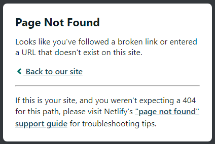
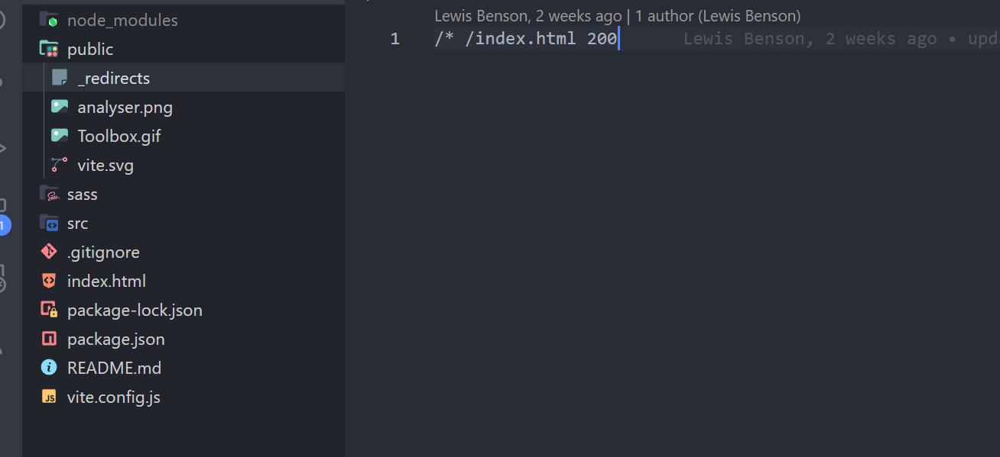

# Fixing BrowserRouter Issues on Netlify with \_redirects

Are you having issues deploying your React app on Netlify using BrowserRouter? In this post, we'll discuss a simple fix by adding a `_redirects` file to your `public` folder, and why Netlify works this way. We'll also explain how this can be beneficial for your app's deployment.

## The Issue: BrowserRouter and Netlify

When deploying a React app using BrowserRouter on Netlify, you might encounter unexpected issues with routing. One of the most common symptoms is receiving a 404 error page when trying to access your app's routes, like the one shown below:



This error occurs because your app's routes are not recognized by the server, causing it to return a 404 error instead of rendering the desired page. The root of this issue lies in the fact that Netlify's default behavior is to serve static assets only. As a result, client-side routing, which is a key feature of BrowserRouter, is not fully supported out of the box.

BrowserRouter relies on the HTML5 History API, allowing for dynamic and clean URLs without the need for a `#` symbol in the route. However, since Netlify is optimized for serving static files, it doesn't have built-in support for handling client-side routing. When a user requests a route that's not the root path, the server looks for a corresponding file to serve but doesn't find one, leading to the 404 error.

Understanding this limitation is crucial to finding a solution that allows your React app to function properly on Netlify with client-side routing. In the next section, we'll explore a simple fix to address this issue by adding a `_redirects` file to your app's public folder.

## The Solution: Adding \_redirects to the Public Folder

To fix the routing issues when using BrowserRouter in your React app deployed on Netlify, you can use a `_redirects` file. This file allows you to define custom routing rules that will be followed by Netlify when serving your app.

In this section, we'll walk you through the process of creating and configuring the `_redirects` file to resolve the routing issues in your React app.

### Step 1: Create the \_redirects File in the Public Folder

First, create a new file called `_redirects` in the public folder of your React app. This folder is where static assets like images, CSS, and JavaScript files are typically placed.

_Note: The \_redirects file does not get a file extension._

### Step 2: Add the Routing Rule

Next, add the following line to the `_redirects` file:

```bash
/* /index.html 200
```

This rule tells Netlify to serve the `index.htm`l file with a `200` status code for any route requested by the user, allowing your React app to handle the client-side routing.

### Step 3: Save the File and Deploy

Save the `_redirects` file and deploy your app to Netlify. Make sure the `_redirects` file is included in the build output, so Netlify can read and apply the custom routing rules.



### Step 4: Additional Setup for Vite (Optional)

If you're using Vite, you'll need to perform an additional step to ensure that the `_redirects` file is included in the `dist` folder when building your project. Follow the instructions provided in the "Additional Setup for Vite" section.

## Additional Setup for Vite (Optional)

In this section, we will focus on the specific steps required to ensure proper setup of a React app with BrowserRouter routing on Netlify when using Vite as your build tool. By following these instructions, you'll make sure the \_redirects file is included in the dist folder during the build process.

### Step 1: Install the vite-plugin-copy2 Package

First, install the `vite-plugin-copy2` package by running the following command in your project's root directory:

```bash
npm install vite-plugin-copy2 --save-dev
```

### Step 2: Update the Vite Config

Now, update your `vite.config.js` file to use the `vite-plugin-copy2` package. Import the necessary modules and add the configuration to include the `_redirects` file in the build output.

Replace your existing `vite.config.js` content with the following code:

```js
import { defineConfig } from 'vite';
import react from '@vitejs/plugin-react';
import { VitePluginCopy } from 'vite-plugin-copy2';

export default defineConfig({
  plugins: [
    react(),

    // Add the vite-plugin-copy2 plugin to handle file copying
    VitePluginCopy({
      // Define the file copying targets
      targets: [
        {
          src: 'public/_redirects', // Specify the source file (_redirects) in the public folder
          dest: 'dist', // Specify the destination folder (dist) for the copied file
        },
      ],
      // Set the hook to run the copy process during the 'writeBundle' phase
      hook: 'writeBundle',
    }),
  ],
});
```

This configuration ensures that the `_redirects` file is copied from the public folder to the `dist` folder when building your Vite project. This way, Netlify will have access to the file and apply the routing rules accordingly.

### Step 3: Build and Deploy

With the configuration in place, build your project using Vite, and deploy the output to Netlify. The `_redirects` file will now be included in the `dist` folder, and the routing issues should be resolved.

By following these steps, you can successfully set up a Vite-based React app with BrowserRouter routing on Netlify.

## Why Netlify Works This Way: Understanding the Benefits

Netlify's default behavior is designed to optimize the serving of static assets, making the hosting of your web applications fast and efficient. This focus on static assets brings several benefits to your projects:

### Performance

By serving pre-built static assets, Netlify can quickly deliver content to users with minimal processing overhead. The result is a lightning-fast website that offers an excellent user experience.

### Security

Static sites are inherently more secure than dynamic sites, as there's no server-side processing or database connections involved. This reduces the number of potential attack vectors, making it more challenging for malicious actors to exploit vulnerabilities.

### Simplicity

Netlify simplifies the deployment process for developers by automating many tasks associated with hosting and managing a website. This makes it easy to get your project up and running quickly, even if you don't have extensive experience with web hosting.

While Netlify's default behavior may require some additional configuration to fully support client-side routing with libraries like React, it's a minor trade-off when considering the benefits provided by Netlify's approach. By making a few small adjustments, like adding a `_redirect`s file, you can enjoy the advantages of Netlify's hosting platform while still leveraging the power of client-side routing in your React apps.

## Conclusion

In this blog post, we explored the issue of deploying a React app with BrowserRouter on Netlify, and how to resolve the routing problem by adding a `_redirects` file to your public folder. We also discussed the benefits of Netlify's focus on serving static assets and how it impacts performance, security, and simplicity for your web projects.

While additional configuration is required to support client-side routing in React apps deployed on Netlify, the benefits of using Netlify as a hosting platform far outweigh the minor trade-offs. With a simple `_redirects` file and the proper setup, you can enjoy a seamless deployment experience and a performant, secure, and easy-to-manage React app hosted on Netlify.

By understanding the root of the issue and applying the solution outlined in this post, you can now confidently deploy your React app using BrowserRouter on Netlify and enjoy all the advantages this powerful hosting platform has to offer.
